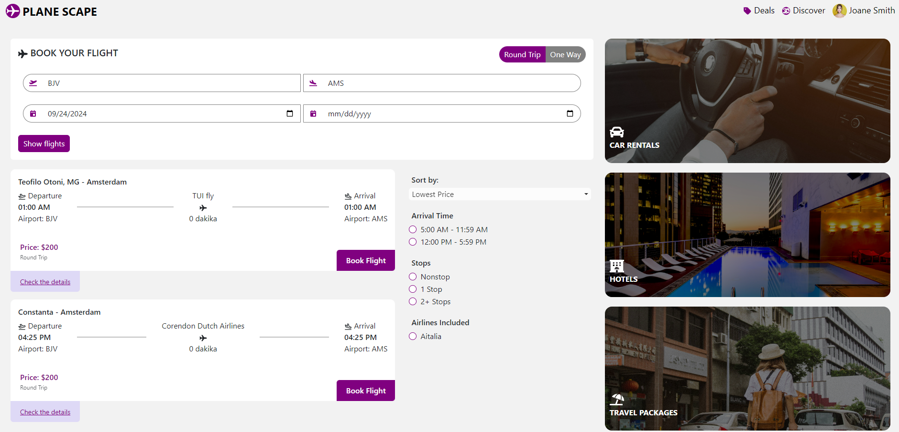
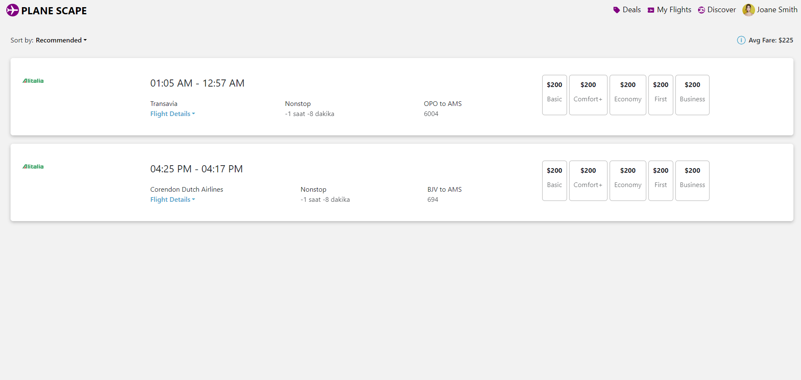

# What I did in the Project
Projede Node.js tabanlı bir backend framework'ü olan Express.js kullanarak, uçuş verilerini MongoDB veritabanına kaydettim. Bu sistem, Amsterdam Schiphol Havalimanı'na gelen ve oradan kalkan uçuşları kullanıcıya göstermektedir. Uçuşların mantığı şu şekildedir: Kalkış noktası farklı bir havalimanı ise varış noktası AMS (Amsterdam Schiphol Havalimanı) olacaktır.

Verilen endpoint'ler aracılığıyla uçuş listelerini istenilen şekilde getirdim. Ayrıca, havalimanı isimlerini ve varış yerindeki şehrin ismini de göstermek için destination/{iata} ve airlines/{airline} endpoint'lerini kullandım.

Veriler arasında uçuş süresi bilgisi bulunmadığı halde, kullanıcıya uçuş süresinin hesaplanmış halini göstermek için bir kod bloğu yazdım. Bu hesaplamanın doğruluğuna dair garanti verilmemekle birlikte, uçuş süresi sonuçlarını gösteriyorum.

Kullanıcı "Book Flight" butonuna bastığında, uçuş geçmiş bir tarihteyse sistem "uçuş geçmiş tarihlidir" mesajı veriyor. Eğer uçuş geçmişte değilse, kullanıcıya bir Toast mesajı göstererek, onu "uçuşlarım" sayfasına yönlendiriyorum.

---

In this project, I used Express.js, a Node.js-based backend framework, to store flight data in a MongoDB database. The system displays flights arriving at and departing from Amsterdam Schiphol Airport. The logic is that if the departure location is from a different airport, the destination will be AMS (Amsterdam Schiphol Airport).

Using the provided endpoints, I successfully fetched the flight lists as required. Additionally, I used the destination/{iata} and airlines/{airline} endpoints to display the airport names and the city names for the destination on the flight cards.

Although the data did not include flight duration, I implemented a code block to calculate and display the estimated flight duration, even if the result might not be accurate.

When the user presses the "Book Flight" button, if the flight date is in the past, the system notifies the user that the flight is dated in the past. If the flight is not in the past, a Toast message is displayed, and the user is redirected to the "My Flights" page.

# Getting Started with Create React App

This project was bootstrapped with [Create React App](https://github.com/facebook/create-react-app).

## Available Scripts

In the project directory, you can run:
### `node server.js`

Open a terminal and navigate to the backend directory of your project.
If you haven't installed the necessary dependencies yet, make sure to run npm install to install all the required packages for the backend.
Once inside the backend directory, you can start the server by running the following command 
node server.js

### `npm start`

Runs the app in the development mode.\
Open [http://localhost:3000](http://localhost:3000) to view it in your browser.

The page will reload when you make changes.\
You may also see any lint errors in the console.

### `npm test`

Launches the test runner in the interactive watch mode.\
See the section about [running tests](https://facebook.github.io/create-react-app/docs/running-tests) for more information.

### `npm run build`

Builds the app for production to the `build` folder.\
It correctly bundles React in production mode and optimizes the build for the best performance.

The build is minified and the filenames include the hashes.\
Your app is ready to be deployed!

See the section about [deployment](https://facebook.github.io/create-react-app/docs/deployment) for more information.

### `npm run eject`

**Note: this is a one-way operation. Once you `eject`, you can't go back!**

If you aren't satisfied with the build tool and configuration choices, you can `eject` at any time. This command will remove the single build dependency from your project.

Instead, it will copy all the configuration files and the transitive dependencies (webpack, Babel, ESLint, etc) right into your project so you have full control over them. All of the commands except `eject` will still work, but they will point to the copied scripts so you can tweak them. At this point you're on your own.

You don't have to ever use `eject`. The curated feature set is suitable for small and middle deployments, and you shouldn't feel obligated to use this feature. However we understand that this tool wouldn't be useful if you couldn't customize it when you are ready for it.

## Learn More

You can learn more in the [Create React App documentation](https://facebook.github.io/create-react-app/docs/getting-started).

To learn React, check out the [React documentation](https://reactjs.org/).

### Code Splitting

This section has moved here: [https://facebook.github.io/create-react-app/docs/code-splitting](https://facebook.github.io/create-react-app/docs/code-splitting)

### Analyzing the Bundle Size

This section has moved here: [https://facebook.github.io/create-react-app/docs/analyzing-the-bundle-size](https://facebook.github.io/create-react-app/docs/analyzing-the-bundle-size)

### Making a Progressive Web App

This section has moved here: [https://facebook.github.io/create-react-app/docs/making-a-progressive-web-app](https://facebook.github.io/create-react-app/docs/making-a-progressive-web-app)

### Advanced Configuration

This section has moved here: [https://facebook.github.io/create-react-app/docs/advanced-configuration](https://facebook.github.io/create-react-app/docs/advanced-configuration)

### Deployment

This section has moved here: [https://facebook.github.io/create-react-app/docs/deployment](https://facebook.github.io/create-react-app/docs/deployment)

### `npm run build` fails to minify

This section has moved here: [https://facebook.github.io/create-react-app/docs/troubleshooting#npm-run-build-fails-to-minify](https://facebook.github.io/create-react-app/docs/troubleshooting#npm-run-build-fails-to-minify)
